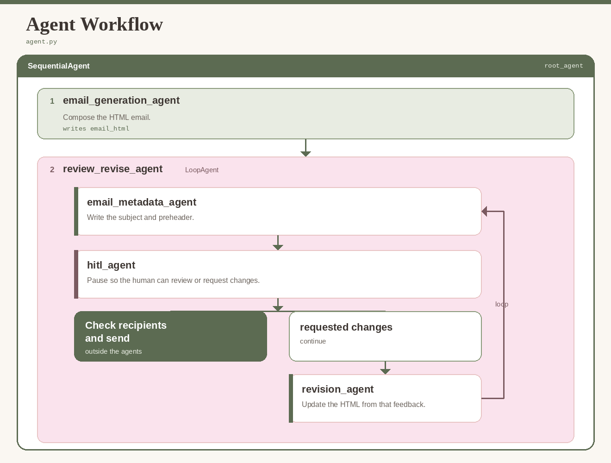

# Marketing Email Generator

This project is an application that uses a multi-agent workflow to generate, revise, and send marketing emails for a small, locally grown cut flower business.

The agents work together to select and arrange reusable HTML content blocks, images, logos, and brand information while generating email copy and calls to action. A human-in-the-loop workflow pauses after a draft is created so the user can review the email, describe desired changes in natural language, or modify the HTML directly.

While this project was created for my wife's small business, the same approach can be adapted for other small businesses that want professionally designed marketing emails without requiring the user to build each email manually. The user does not need to understand HTML or CSS to create or revise the email, since the agents handle those implementation details based on the user's natural-language instructions.

## Description

The agent architecture follows this workflow:

The application begins with instructions from the user describing what the email is for, how it should be styled, the content it should contain, and any other campaign requirements.

Selecting **Generate Email** starts the agent workflow. The agents construct the email, including the subject line and preheader, using the available content blocks, images, logo, and brand information.

The workflow then pauses so the user can review the draft and request changes. This review and revision process can continue until the user is satisfied with the result.

Once the email is complete, the user can provide a distribution list. The application checks recipients against the unsubscribe list before allowing the email to be sent.

## Key Features

This application uses Google's Agent Development Kit (ADK) to implement the multi-agent workflow described above.

The agent workflow is wrapped in a FastAPI web application to make interaction with the system straightforward and to provide a clean interface for viewing the email as it is created and revised.

The application is hosted on Google Cloud. Images, reusable content blocks, brand assets, and other application data are stored using Google Cloud Storage.

Because the application is intended for small-scale business use, email delivery is handled through Gmail. The user can connect their own Gmail account through OAuth when they are ready to send.

After the email is finalized, the user can paste in a distribution list of email addresses, validate the list against existing unsubscribes, and send the completed email.

## Technology

The application is built using:

* **Google Agent Development Kit (ADK)** for the multi-agent workflow and human-in-the-loop interaction
* **Gemini** for email generation, reasoning, and revision
* **FastAPI** for the web application and API layer
* **Google Cloud Run** for application hosting
* **Google Cloud Storage** for images, reusable content blocks, brand assets, and application data
* **Gmail API and OAuth** for user-authorized email delivery

## Getting Started

You can try the deployed application here:

https://marketing-email-generator-523597855488.us-east1.run.app/
